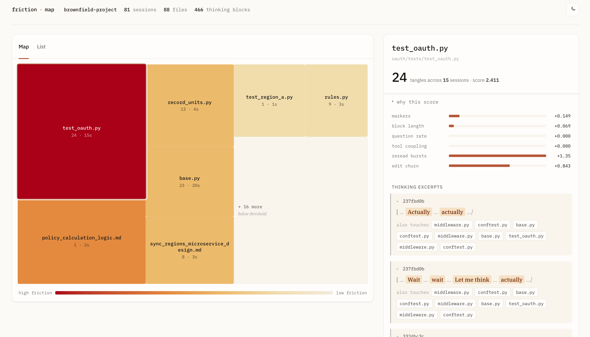
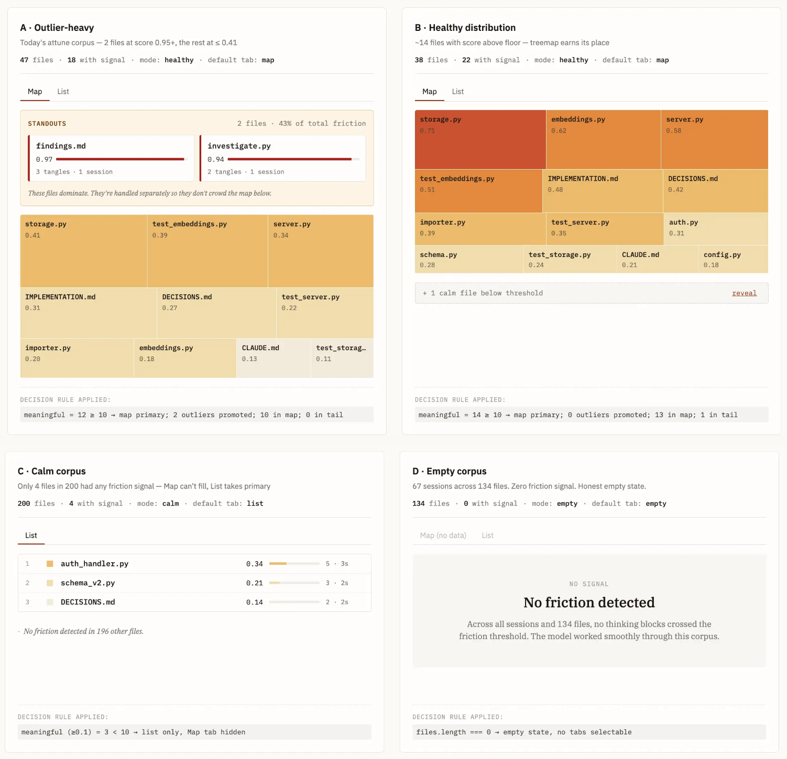

# FrictionMap

[](https://github.com/alatruwe/frictionmap/actions/workflows/ci.yml)

**File-level observability for AI coding sessions.**

FrictionMap parses AI coding session logs and produces a self-contained interactive HTML report ranking every file in a codebase by how much friction the model experienced working with it — measured by re-evaluation patterns in extended thinking, retry behavior, and edit churn.

```bash
$ cd ~/Projects/my-app
$ frictionmap scan
Parsed 64 sessions across 9043 events. 206 files with friction signals. Report: report.html
$ open report.html
```



---

Code-quality tools tell you which files are complex. FrictionMap tells you which files the chat gets rough on.

It's the retrospective view: where in this codebase has the model been getting tangled, aggregated across every session you've run.

**Claude Code is the starting point.** The signal extraction architecture is agent-agnostic; the parser layer is what's Claude-specific. Adapters for other agents (Codex, Aider, Cursor) are a natural extension if there's demand.

## Install

Requires Python 3.11+.

```bash
git clone https://github.com/alatruwe/frictionmap
cd frictionmap
pip install -e .
```

## Usage

FrictionMap reads sessions from `~/.claude/projects/<project>/` — the location Claude Code writes to. Run it from your project root and it walks up to find the matching sessions directory.

**Corpus scan.** Aggregates every session for the current project into one HTML report.

```bash
$ frictionmap scan
Parsed 64 sessions across 9043 events. 206 files with friction signals. Report: report.html
```

The report is one self-contained HTML file with data embedded as JSON — share it via Gist, Slack, or email; no server required.

**Recent sessions.** List sessions with activity in the last 12 hours.

```bash
$ frictionmap active-sessions
3 sessions with activity in the last 12 hours:
  [978c30c2]  "Fix migration order in storage.py"            2 minutes ago
  [e26ba0d6]  "Design review for multi-user schema"          3 hours ago
  [7bc17a16]  "Debug Ollama embedding dimension mismatch"    8 hours ago
```

**Single session.** Terminal summary for one session, identified by ID prefix or title substring.

```bash
$ frictionmap session 978c30c2
Session: 978c30c2 "Fix migration order in storage.py"
Turns: 14 | Files touched: 3 | Thinking blocks: 5

Top friction this session:
  /path/to/storage.py       score 0.31 | 2 marker excerpts
  /path/to/migrations.py    score 0.27 | 1 marker excerpts
```

## Report views

The report picks one of four modes based on what the data surfaces.



- **Outlier-heavy.** Two or three files dominate. Promoted to a Standouts panel above the map.
- **Healthy distribution.** A dozen-plus files with meaningful signal. Treemap is the primary view.
- **Calm corpus.** Few files cleared the friction floor. List view replaces the map.
- **Empty corpus.** No file crossed the floor. Explicit empty state: "the model worked smoothly through this corpus."

## Roadmap

- **v2 — friction maps for autonomous agents.** Extend FrictionMap beyond interactive
  Claude Code sessions to autonomous agent trajectories (SWE-bench Verified) — the same
  file-level friction view for agent runs. Gated on a transfer study: do v1's signals
  carry over, and do they add information beyond action-sequence encodings?
- **v2 — semantic friction scoring.** An LLM-judge layer scoring friction in reasoning
  traces directly, beyond v1's deterministic counting. Gated on a pre-registered
  validation study against blind human labels.
- **Multi-agent support.** Adapters for Codex, Aider, Cursor, and other agents. Driven
  by demand — open an issue if you'd use this on non-Claude sessions.

## Caveats

- **Sessions with extended thinking disabled produce zero reasoning signal.** A corpus dominated by such sessions will produce a thin friction map.
- **Claude Code retains session JSONL for roughly 30 days by default.** The report covers what's on disk; older sessions are not recoverable.
- **Large monorepos.** The HTML file-tree view can feel sluggish on very large codebases. Mid-size repos work cleanly.

## Methodology & writing

See [`project_design/HOW_IT_WORKS.md`](project_design/HOW_IT_WORKS.md) for how the scoring
function works, what it deliberately doesn't measure, and the methodological caveats.
The `project_design/` folder contains the design documents from the build: scope,
trade-offs, tested assumptions, ecosystem framing, and the parser-to-report data contract.

Research methodology for the v2 judge study — pre-registration, cost budget, and SWE-bench trajectory recon — lives in [methodology/](methodology/).

Two essays document the calibration methodology and findings:

- **[The craft of proxy measurement](https://thecognitivestack.substack.com/p/the-craft-of-proxy-measurement)** — how the v1 signals were calibrated, and why eight of eleven signals are parked at weight 0 with documented handoff records rather than dropped.
- **[Friction in AI coding sessions: what the data shows](https://thecognitivestack.substack.com/p/friction-in-ai-coding-sessions)** — findings from running FrictionMap on the reference corpora.

## License

MIT.
